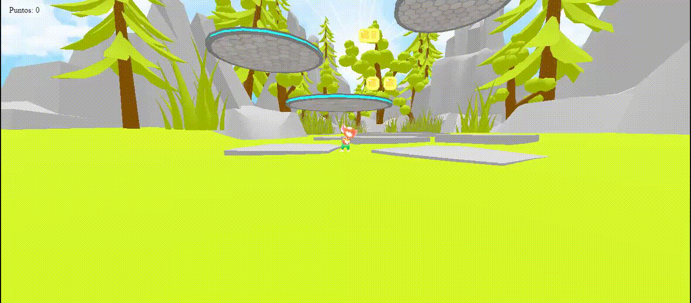

# Jumper

Jumper es un juego desarrollado en Three.js que te desafía a escalar plataformas con un personaje que es un ratón. El objetivo es recolectar monedas en cada plataforma y llegar a la estrella ubicada en la última plataforma para ganar.

## Características principales

- **Gráficos en 3D:** Disfruta de entornos y personajes detallados en un mundo tridimensional.
- **Diversión adictiva:** El desafío de escalar plataformas y recolectar monedas te mantendrá entretenido durante un tiempo.
- **Controles simples:** Controla al ratón con teclas simples para saltar y moverte.

## Vista del juego

## Jugar

Para poder jugar accede al siguiente link: https://impah.github.io/Jumper/

## Controles

- **Espacio:** Saltar.
- **Teclas A y D:** Moverse hacia la izquierda y hacia la derecha.

### Controles para Celular

- **Deslizar verticalmente para arriba:** Saltar.
- **Mantener para izquierda o derecha:** Moverse hacia la izquierda y hacia la derecha.

## Licencia

Este proyecto está bajo la Licencia MIT. Consulta el archivo `LICENSE` para obtener más detalles.
